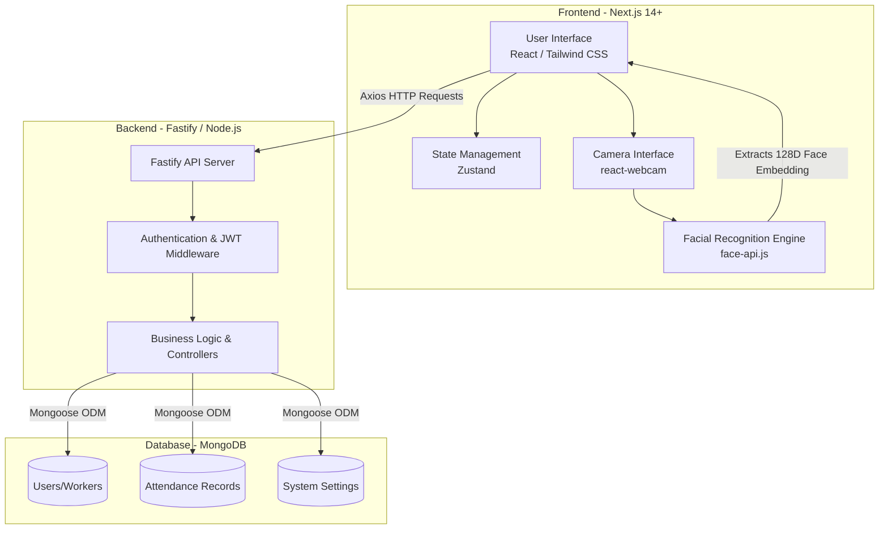

# Biometric Payroll System

A comprehensive, full-stack biometric attendance and automated payroll management system. This application uses cutting-edge facial recognition technology in the browser to accurately log worker attendance and automatically calculate payroll based on the total hours worked.

---

## 🏗️ Architecture Diagram



---

## ✨ Key Features

- **Biometric Attendance Terminal:** A standalone kiosk interface where workers can log their `Punch In` and `Punch Out` times simply by scanning their faces.
- **Advanced Facial Recognition:** Uses `face-api.js` to process facial landmarks and extract 128-dimensional embeddings entirely on the client side, ensuring privacy and speed.
- **Automated Payroll Calculation:** Automatically calculates total hours worked between punch in/out and generates gross salary based on the hourly rate.
- **Role-Based Access Control (RBAC):**
  - **Admin:** Can register new workers (including their face embeddings), view logs, and generate payroll.
  - **Worker:** Can log in to view their attendance history and generated payroll.
- **Modern Tech Stack:** Built with Next.js (Turbopack) and Fastify for lightning-fast performance.

---

## 🛠️ Technology Stack

### Frontend
- **Framework:** Next.js (React)
- **Styling:** Tailwind CSS, shadcn/ui
- **State Management:** Zustand
- **Facial Recognition:** face-api.js
- **Camera integration:** react-webcam
- **HTTP Client:** Axios

### Backend
- **Framework:** Fastify (Node.js)
- **Database:** MongoDB with Mongoose ODM
- **Authentication:** JSON Web Tokens (JWT)
- **Utility:** date-fns (for time calculations)

---

## 🚀 Getting Started

### Prerequisites
- Node.js (v18 or higher)
- MongoDB (Running locally on port 27017 or a MongoDB Atlas URI)

### 1. Database Setup
Ensure your MongoDB server is running. By default, the application connects to `mongodb://localhost:27017/biometric_payroll`.

### 2. Backend Setup
1. Navigate to the backend directory:
   ```bash
   cd backend
   ```
2. Install dependencies:
   ```bash
   npm install
   ```
3. Start the backend development server (Runs on Port 8080 by default):
   ```bash
   npm run dev
   ```

### 3. Frontend Setup
1. Open a new terminal and navigate to the frontend directory:
   ```bash
   cd frontend
   ```
2. Install dependencies:
   ```bash
   npm install
   ```
3. Start the frontend development server:
   ```bash
   npm run dev
   ```

---

## 📖 How to Use

1. **Admin Setup & Worker Registration:**
   - Navigate to `http://localhost:3000/login/admin` to log into the Admin portal.
   - Go to the **Workers** tab and click **Register Worker**.
   - Enter the worker's details and proceed to the Face Registration step to capture and save the worker's facial embedding.

2. **Biometric Kiosk (Attendance):**
   - Open `http://localhost:3000/biometric` on the dedicated terminal device.
   - The worker stands in front of the camera and selects **Start Shift (Punch In)**.
   - At the end of the day, the worker selects **End Shift (Punch Out)** to complete their attendance.

3. **Payroll Generation:**
   - As an Admin, go to the **Payroll** tab in the dashboard.
   - Select the desired month and year, and click **Calculate Payroll** to instantly generate salaries based on tracked attendance.

---

## 🔒 Security & Privacy
- **Face Embeddings, not Images:** The system does not save actual photos of the workers. Instead, it extracts and stores a mathematical representation (128D embedding array) of the face, ensuring biometric privacy.
- **JWT Protection:** All sensitive API routes are protected using fast and secure JSON Web Tokens.
